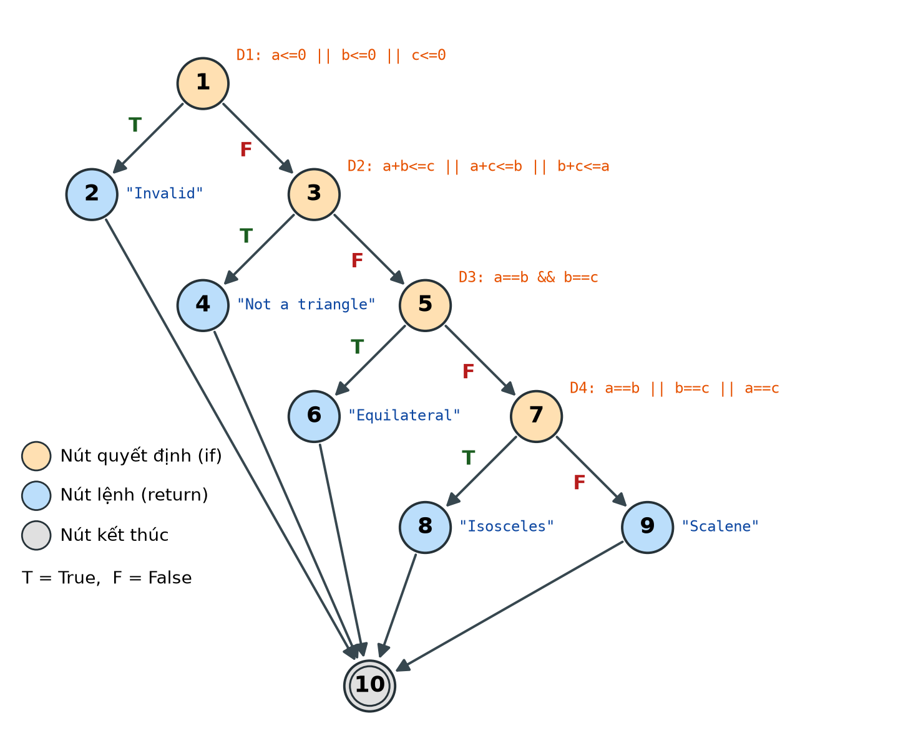
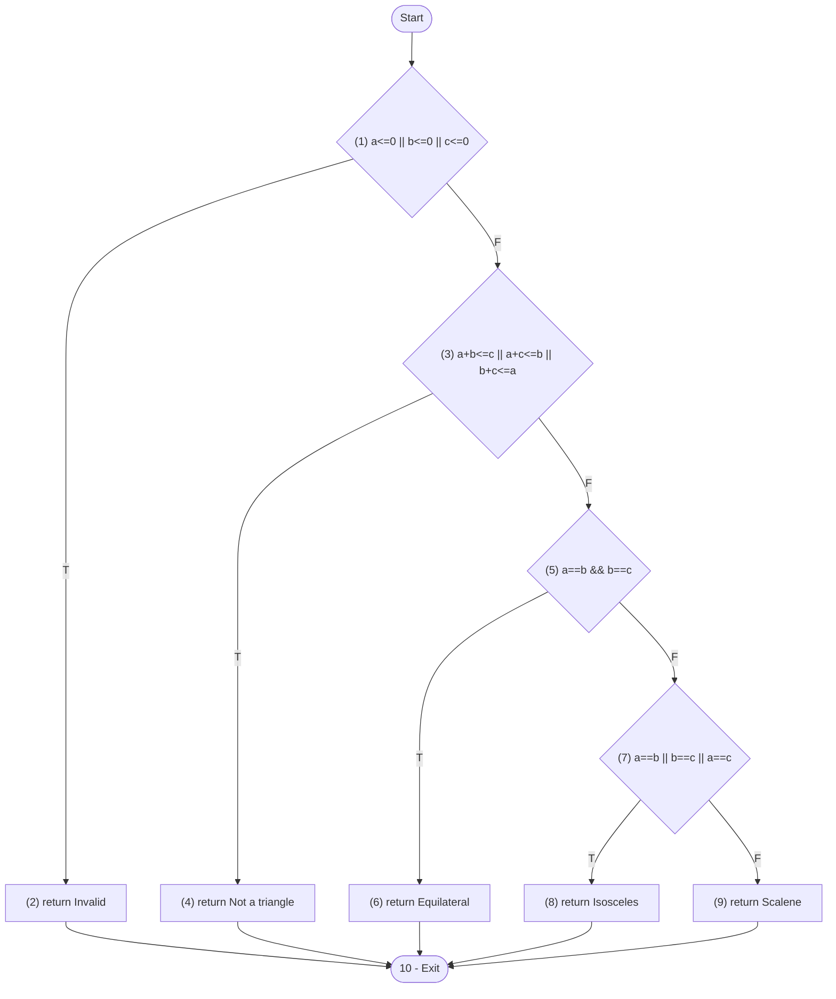
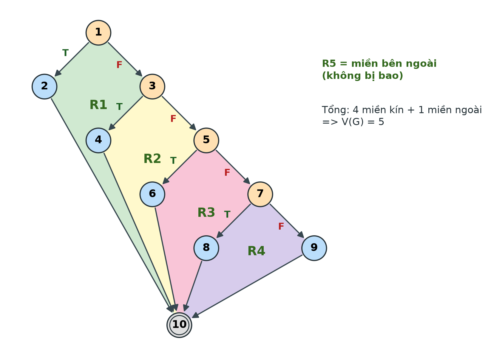
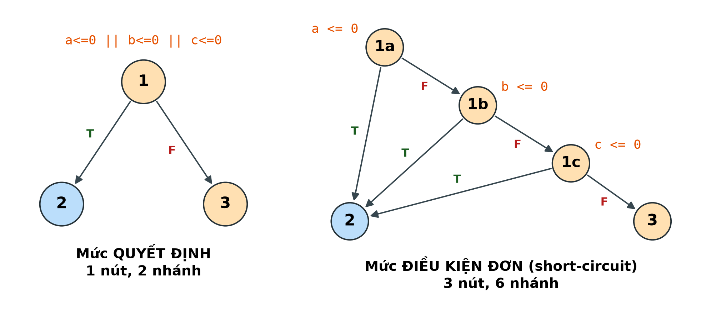
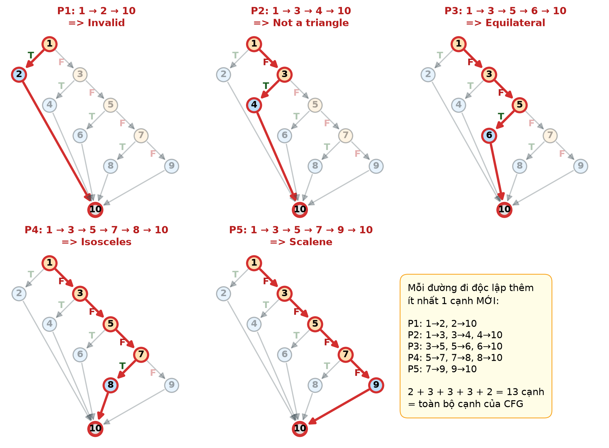

# Bài 1 — CFG, độ phức tạp chu trình và độ bao phủ cho `Triangle.classify`

## 0. Mã nguồn và đánh số nút

Mỗi câu lệnh / điều kiện được gán một số hiệu nút để vẽ đồ thị. Điều kiện phức (nhiều vế nối bằng `||`, `&&`) được xem là **một nút quyết định** — đây là mức chi tiết dùng cho Statement Coverage và Branch Coverage.

```java
public static String classify(int a, int b, int c) {

    if (a <= 0 || b <= 0 || c <= 0) {                   // (1)
        return "Invalid";                               // (2)
    }

    if (a + b <= c || a + c <= b || b + c <= a) {       // (3)
        return "Not a triangle";                        // (4)
    }

    if (a == b && b == c) {                             // (5)
        return "Equilateral";                           // (6)
    } else if (a == b || b == c || a == c) {            // (7)
        return "Isosceles";                             // (8)
    } else {
        return "Scalene";                               // (9)
    }
}                                                       // (10) exit
```

| Nút | Loại | Nội dung |
| --- | --- | --- |
| 1 | Quyết định **D1** | `a <= 0 \|\| b <= 0 \|\| c <= 0` |
| 2 | Lệnh | `return "Invalid"` |
| 3 | Quyết định **D2** | `a + b <= c \|\| a + c <= b \|\| b + c <= a` |
| 4 | Lệnh | `return "Not a triangle"` |
| 5 | Quyết định **D3** | `a == b && b == c` |
| 6 | Lệnh | `return "Equilateral"` |
| 7 | Quyết định **D4** | `a == b \|\| b == c \|\| a == c` |
| 8 | Lệnh | `return "Isosceles"` |
| 9 | Lệnh | `return "Scalene"` |
| 10 | Kết thúc | Thoát khỏi phương thức |

## 1. Control Flow Graph (CFG)



*Hình 1. CFG của `classify` ở mức quyết định: nút cam là nút quyết định (`if`), nút xanh là lệnh `return`, nút 10 là điểm kết thúc; T = True, F = False.*

<details>
<summary>Cùng CFG ở dạng Mermaid (GitHub tự vẽ lại từ mã)</summary>



</details>

Danh sách cạnh (13 cạnh):

| # | Cạnh | # | Cạnh | # | Cạnh |
| --- | --- | --- | --- | --- | --- |
| e1 | 1 → 2 (D1 = T) | e6 | 5 → 6 (D3 = T) | e11 | 6 → 10 |
| e2 | 1 → 3 (D1 = F) | e7 | 5 → 7 (D3 = F) | e12 | 8 → 10 |
| e3 | 3 → 4 (D2 = T) | e8 | 7 → 8 (D4 = T) | e13 | 9 → 10 |
| e4 | 3 → 5 (D2 = F) | e9 | 7 → 9 (D4 = F) | | |
| e5 | 2 → 10 | e10 | 4 → 10 | | |

## 2. Độ phức tạp chu trình (Cyclomatic Complexity)

Tính theo 3 công thức, cả 3 đều cho cùng kết quả:

| Công thức | Thay số | Kết quả |
| --- | --- | --- |
| V(G) = E − N + 2 | 13 − 10 + 2 | **5** |
| V(G) = P + 1 (P = số nút quyết định) | 4 + 1 (nút 1, 3, 5, 7) | **5** |
| V(G) = số miền của đồ thị phẳng | 4 miền kín + 1 miền ngoài | **5** |



*Hình 2. Bốn miền kín R1–R4 và miền ngoài R5 ⇒ V(G) = 5.*

> **CC = 5** ⇒ cần tối đa 5 đường đi độc lập để phủ mọi cạnh của CFG, và đó cũng là số test case của tập đường cơ sở.

**Ghi chú — nếu tách điều kiện phức thành điều kiện đơn.** Khi vẽ CFG chi tiết, mỗi vế của `||` / `&&` là một nút quyết định riêng (do có short-circuit):

| Quyết định | Số điều kiện đơn |
| --- | --- |
| D1: `a <= 0`, `b <= 0`, `c <= 0` | 3 |
| D2: `a + b <= c`, `a + c <= b`, `b + c <= a` | 3 |
| D3: `a == b`, `b == c` | 2 |
| D4: `a == b`, `b == c`, `a == c` | 3 |
| **Tổng** | **11** |



*Hình 3. Ví dụ với D1: một nút quyết định (trái) so với ba nút điều kiện đơn khi tính short-circuit (phải).*

Khi đó V(G) = 11 + 1 = **12**. Công cụ JaCoCo cũng báo complexity của `classify` là 12 (xem mục 5), vì nó đo trên bytecode, nơi mỗi điều kiện đơn là một lệnh rẽ nhánh riêng. Đề bài chỉ yêu cầu Statement và Branch Coverage nên bài làm dùng CFG mức quyết định (CC = 5).

## 3. Các đường đi độc lập (Basis paths)

| Đường | Dãy nút | Cạnh mới so với các đường trước | Kết quả |
| --- | --- | --- | --- |
| **P1** | 1 → 2 → 10 | e1, e5 | Invalid |
| **P2** | 1 → 3 → 4 → 10 | e2, e3, e10 | Not a triangle |
| **P3** | 1 → 3 → 5 → 6 → 10 | e4, e6, e11 | Equilateral |
| **P4** | 1 → 3 → 5 → 7 → 8 → 10 | e7, e8, e12 | Isosceles |
| **P5** | 1 → 3 → 5 → 7 → 9 → 10 | e9, e13 | Scalene |



*Hình 4. Năm đường đi độc lập P1–P5 (tô đỏ) trên CFG.*

Mỗi đường đều đi qua ít nhất một cạnh chưa có ở các đường trước, và 5 đường cùng nhau phủ đủ 2 + 3 + 3 + 3 + 2 = **13 / 13 cạnh**. Số đường bằng đúng V(G) = 5, nên đây là một tập đường cơ sở (basis set) hoàn chỉnh.

## 4. Thiết kế test case

### 4.1. Bộ test case

| ID | Đường | Đầu vào (a, b, c) | Lý do chọn dữ liệu | Kết quả mong đợi |
| --- | --- | --- | --- | --- |
| TC01 | P1 | (0, 4, 5) | `a = 0` ⇒ D1 đúng | `Invalid` |
| TC02 | P2 | (1, 2, 3) | Các cạnh dương, nhưng `a + b = c` ⇒ D2 đúng (tam giác suy biến) | `Not a triangle` |
| TC03 | P3 | (3, 3, 3) | Tam giác hợp lệ, `a == b == c` ⇒ D3 đúng | `Equilateral` |
| TC04 | P4 | (3, 3, 5) | Tam giác hợp lệ, `a == b`, `b != c` ⇒ D3 sai, D4 đúng | `Isosceles` |
| TC05 | P5 | (3, 4, 5) | Tam giác hợp lệ, 3 cạnh khác nhau ⇒ D3 sai, D4 sai | `Scalene` |

### 4.2. 100% Statement Coverage

Mỗi lần chạy `classify` chỉ kết thúc ở **đúng một** trong 5 lệnh `return` (nút 2, 4, 6, 8, 9), nên cần **tối thiểu 5 test case** mới phủ hết câu lệnh.

| Nút / câu lệnh | TC01 | TC02 | TC03 | TC04 | TC05 |
| --- | :-: | :-: | :-: | :-: | :-: |
| (1) `if` D1 | ✔ | ✔ | ✔ | ✔ | ✔ |
| (2) `return "Invalid"` | ✔ | | | | |
| (3) `if` D2 | | ✔ | ✔ | ✔ | ✔ |
| (4) `return "Not a triangle"` | | ✔ | | | |
| (5) `if` D3 | | | ✔ | ✔ | ✔ |
| (6) `return "Equilateral"` | | | ✔ | | |
| (7) `else if` D4 | | | | ✔ | ✔ |
| (8) `return "Isosceles"` | | | | ✔ | |
| (9) `return "Scalene"` | | | | | ✔ |

⇒ 9 / 9 câu lệnh được thực thi: **Statement Coverage = 100%** với {TC01, …, TC05}.

### 4.3. 100% Branch Coverage

Có 4 nút quyết định ⇒ 4 × 2 = **8 nhánh** cần phủ.

| Nhánh | TC01 | TC02 | TC03 | TC04 | TC05 |
| --- | :-: | :-: | :-: | :-: | :-: |
| D1 = True (1 → 2) | ✔ | | | | |
| D1 = False (1 → 3) | | ✔ | ✔ | ✔ | ✔ |
| D2 = True (3 → 4) | | ✔ | | | |
| D2 = False (3 → 5) | | | ✔ | ✔ | ✔ |
| D3 = True (5 → 6) | | | ✔ | | |
| D3 = False (5 → 7) | | | | ✔ | ✔ |
| D4 = True (7 → 8) | | | | ✔ | |
| D4 = False (7 → 9) | | | | | ✔ |

⇒ 8 / 8 nhánh được phủ: **Branch Coverage = 100%** với cùng bộ {TC01, …, TC05}.

**Kết luận:** 5 test case theo 5 đường cơ sở đạt đồng thời 100% Statement Coverage và 100% Branch Coverage. Đây cũng là số test case nhỏ nhất có thể, vì Statement Coverage đã đòi hỏi ít nhất 5 (mục 4.2), và Branch Coverage bao hàm Statement Coverage.

## 5. Kiểm chứng bằng JUnit + JaCoCo

- Mã nguồn: [Triangle.java](../src/main/java/Triangle.java)
- Test tự động: [TriangleTest.java](../src/test/java/TriangleTest.java) — mỗi test `TC01` – `TC05` ứng với một dòng của bảng 4.1.

```bash
mvn test
# Bao cao do bao phu: target/site/jacoco/index.html
```

Kết quả đo được cho phương thức `classify`:

| Chỉ số JaCoCo | Kết quả | Ý nghĩa |
| --- | --- | --- |
| Tests | 5 run, 0 failure | Cả 5 test case cho đúng kết quả mong đợi |
| Lines | 9 / 9 (100%) | **Statement Coverage = 100%** |
| Instructions | 46 / 46 (100%) | Mọi lệnh bytecode của `classify` đều được thực thi |
| Branches | 16 / 22 (72%) | Đo ở mức **điều kiện đơn** (11 điều kiện × 2 = 22), không phải mức quyết định |
| Complexity | 12 | Trùng với V(G) của CFG đã tách điều kiện đơn (mục 2) |

JaCoCo chỉ số "Branches" < 100% **không** mâu thuẫn với kết luận Branch Coverage = 100% ở mục 4.3: JaCoCo coi mỗi vế của `||` / `&&` là một nhánh riêng, tức là đo gần với **Condition Coverage** — tiêu chí mạnh hơn yêu cầu của đề. 6 nhánh còn thiếu là các vế chưa bao giờ nhận giá trị `true` do short-circuit:

| Vế chưa nhận `true` | Test case bổ sung (tuỳ chọn) | Kết quả |
| --- | --- | --- |
| `b <= 0` (D1) | (4, 0, 5) | `Invalid` |
| `c <= 0` (D1) | (4, 5, 0) | `Invalid` |
| `a + c <= b` (D2) | (1, 3, 2) | `Not a triangle` |
| `b + c <= a` (D2) | (3, 1, 2) | `Not a triangle` |
| `b == c` (D4) | (5, 3, 3) | `Isosceles` |
| `a == c` (D4) | (3, 5, 3) | `Isosceles` |

Thêm 6 test case này thì JaCoCo sẽ báo 22 / 22 nhánh. Đây là phần mở rộng, đề bài không bắt buộc.
